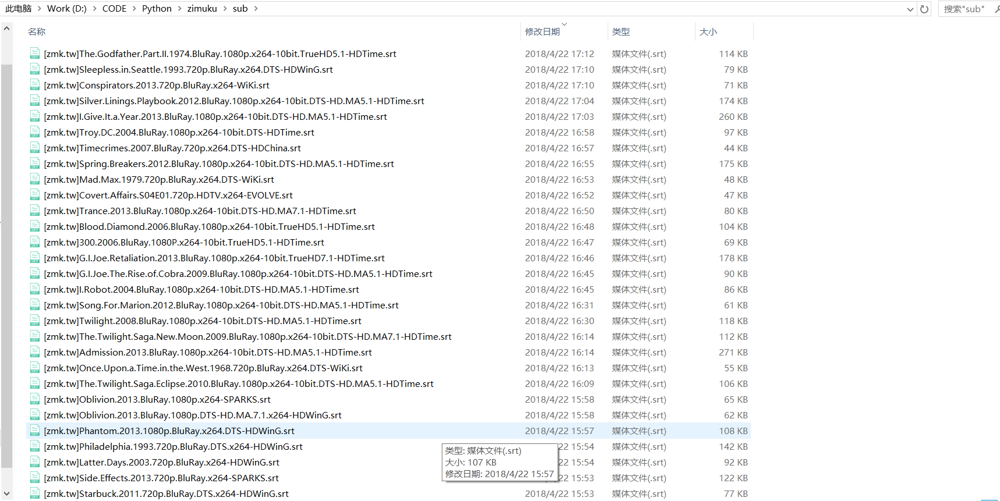

# 字幕库字幕爬虫


## 简介

zimuku 是针对[字幕库](www.zimuku.cn)的字幕爬取脚本，但是针对的并不是某个电影，而是获取全量的字幕文件,

用来做数据分析以及自然语言处理等.

zimuku是用下标区分一个字幕资源的，所以可以直接用下标遍历去获取每一个字幕资源

## 依赖

由于zimuku的每天下载的字幕文件数量做了限制，所以本爬虫使用了代理，在run.py->get_proxy()函数用使用了github上的[proxyPool](https://github.com/Python3WebSpider/ProxyPool)开源代理管理脚本，你也可以使用自己的代理方法


## 安装

```bash
git clone git@github.com:Acring/zimuku.git
```


## 使用

在main函数中修改变量

- start(要获取的第一个资源的下标)
- end(要获取的最后一个资源的下标)
- filter_sub的筛选条件(字幕语言和字幕格式)

运行脚本

```bash
python3 run.py
```


## 特别说明


如果遇到一直返回`<Response [404]>`， 可以开启fiddler作为代理服务器再去运行脚本，原因暂时不了解


## 文件截图

